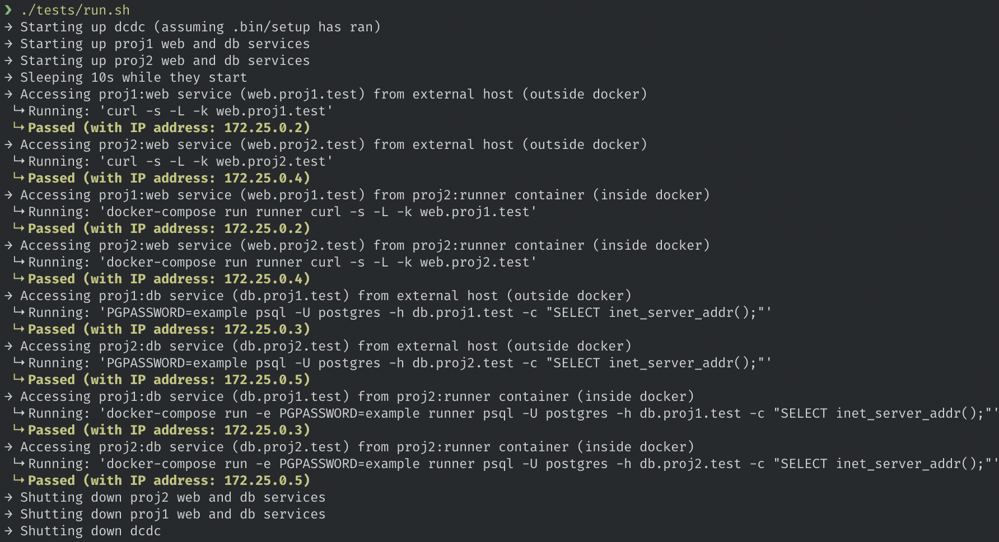

# Docker Compose DNS Consistency (DCDC)
-----

DCDC's purpose is to provide an easy way to work with multiple Docker Compose projects locally by:

1. Exposing fully qualified domain names for each service (ending in `.test`) using DNS and reverse proxy.
2. Providing consistent DNS resolution for services internal and external to the Docker network (i.e., `db.proj.test` is accessible on host machine and also from a service's container).
3. Requiring as little configuration to projects to make them work with DCDC.



**NOTE:** DCDC only works with macOS. It is likely possible to work for other operating systems although will require some rejigging.

## Setup

```
./bin/setup
docker-compose up
```

Using `./bin/setup` configures our host machine's DNS to resolve `*.test` to `127.0.0.1` (localhost). It also adds and trusts the `*.test` self-signed certificate to your system's keychain. In addition, it adds all the required external IPs as noted in `dnsmasq-ext/external.host`.

Using `docker-compose up` will start up the `nginx` proxy, and both `dnsmasq` resolvers.

## In Other Projects

In other projects (or more specifically their `docker-compose.yml` files) we can do the following:

```diff
version: "3.7"

services:
  web:
+    environment:
+     - VIRTUAL_HOST=web.proj1.test
+     - VIRTUAL_PORT=8000
+   dns: 172.25.0.253

  db:
+    ports:
+       - 127.0.1.1:3306:3306
+    environment:
+       - VIRTUAL_HOST_WITH_HOSTIP=db.proj1.test
+    dns: 172.25.0.253

+networks:
+  default:
+    external:
+      name: dcdc_default
```

These changes do the following:

- Our services use the default network that is created by our `dev` project. Being on the same network allows all the containers to communicate with each other.
- Adding the `VIRTUAL_HOST` and `VIRTUAL_PORT` allows us to map HTTP service via the nginx proxy.
- Adding a _host ip_ on the port assignment of a non-HTTP service allows us to expose that service's port externally.
- Setting the `VIRTUAL_HOST_WITH_HOSTIP` environment variable allows us to configure the name of the virtual host for internal/external usage.
- All services specify the `dns` to the IP of our internal `dnsmasq` container's IP, so they can internally resolve the virtual hosts correctly.

## How It All Works
<details><summary>Let me see under the hood!</summary>

<br>

First, let us cover a pain point that exists when using Docker Compose and how we can alleviate it. Ultimately, we will see that this project offers us a great solution.

### Problem

We have a project (i.e., `proj1`) that contains an API (`api`) service. With Docker, we are able to expose the API server's default port (`3000`). Thus `localhost:3000` routes to the API of `proj1`. We have another project (i.e., `proj2`) that also contains an API (`api`) service and is also exposed on the default port of `3000`.

Both projects exist as separate repositories and therefore has a different `docker-compose.yml` file. In isolation, both projects run without any problem, and expose their API service on `localhost:3000`. The issue is when you want to run both projects at the same time, which might be needed for the development of a new feature or testing a complete flow.

The naive solution is to change one of the exposed ports for a project to `3001` so that the there is no clashing of ports. So for example, `proj2`'s API is now exposed on port `3001` and is reachable at `localhost:3001`.

There are a few problems here:

  1. This process of ensuring we have no conflicting ports on the host can be painful. Even if the projects aren't related, you can have conflicting ports being exposed. As the number of projects scale this becomes more challenging and likely a place is needed to keep track of used ports (or port ranges).
  2. If the two projects have to communicate to each other internally (i.e., not via the host's web browser), the projects cannot see each other as they are on a different network (by default).
  3. Externally to the Docker network, we refer to the APIs as `localhost:<port>`, but internally we need to use the _service name_ like `proj1`. There is a disconnect in how we _refer_ to the services internally and externally to the Docker network.

### Solution

We can use virtual hosts to give a name to each service (i.e., `api.proj1.test`), which removes the _port clashing_ problem. As long as the hostnames are unique there are no issues.

There are many approaches to accomplishing this, but ultimately we decided upon using a combination of [`nginx-proxy`](https://github.com/jwilder/nginx-proxy) and [`dnsmasq`](http://www.thekelleys.org.uk/dnsmasq/doc.html) to accomplish this. This [article](https://medium.com/@sumankpaul/use-nginx-proxy-and-dnsmasq-for-user-friendly-urls-during-local-development-a2ffebd8b05d) provides a great introduction to the solution.

Essentially, every Docker container which connects/disconnects to the network that `nginx-proxy` is running on will regenerate the proxy's nginx configuration. The configuration is set to proxy request to containers using a `VIRTUAL_HOST` environment variable defined in that service's `docker-compose.yml`. Nginx will proxy requests to their internal containers based on the `VIRTUAL_HOST` value.

There is a little bit of extra required to make this work on macOS. We need to use `dnsmasq` to route `*.test` URLs to our proxy. To keep things containerized we use `dnsmasq` in Docker and expose the DNS resolution to the host machine (port `53`). We also need a dedicated Docker network so that all the services can communicate with each other. To ensure that services are stable we set static IPs for these essential services and set up a default network that all `docker-compose.yml` files can use.

#### The First Gotcha -- Internal/External Resolutions

With respect to the pain points, our current solution solves #1 and #2 but doesn't address #3. We have non-clashing services, and due to the nature of how we have set up the services, we use the same default docker network. We still want the Docker services to be consistently accessible from both the host machine and the internal Docker containers.

Effectively, we want the same virtual host resolution to happen on both the Docker network and the host machine. To accomplish this, we need to introduce a second `dnsmasq`! We will have one for the internal DNS resolution and one for the external DNS resolution. We then specify our project containers to use the internal `dnsmasq` for it's DNS resolution, while the external one continues to function properly. This way we can refer to `api.proj1.test` both internally and externally to the Docker network.

#### The Second Gotcha -- Non-HTTP Services

With our solution so far, HTTP services work in both internal/external cases. The problem arises with non-HTTP services (i.e., databases). With nginx's reverse proxy approach, requests have the hostname in the request's header and this helps route the request to the appropriate service. With non-HTTP services, they cannot pass this information in a header, and thus they don't function properly.

To remedy this situation, we need to route our non-HTTP services directly to unique IPs. Fortunately, we can continue to use the `dnsmasq` tool to accomplish this.

##### Internal Changes

For internal usage, we're going to take advantage of [docker-gen](https://github.com/jwilder/docker-gen) to dynamically generate a _hostfile_ (`internal.host`) file. This file will list all the non-HTTP services that exist on the connected Docker network, for example:

```
# The following is the DNS mapping for non-HTTP containers (i.e., databases)
# They are dynamically determined if there is a HostIP set on the service
# and if there is a VIRTUAL_HOST_WITH_HOSTIP environment variable set
#
# i.e.,
#   ports:
#     - 127.10.0.1:3306:3306
#   environment:
#     VIRTUAL_HOST_WITH_HOSTIP: "db.my-project.test"
# --------------------------------------------------------------------------
#
# DNS for db proj1
172.25.0.2    db.proj1.test
# DNS for db proj2
172.25.0.3    db.proj2.test
```

In the above example, we list out the unique entries for the databases of our projects that point to the IP of their container. By using `docker-gen` we ensure that this hostfile is valid based on the containers that are running on the network. We also send a `HUP` signal to `dnsmasq` after each change to the hostfile so that the DNS changes are reflected correctly.

##### External Changes

For external usage, we again need to explicitly map a hostname to a container's IP. Unfortunately, Docker on macOS does not allow us to _cross into the Docker network_ and pull out IPs for containers from the host machine. Fortunately, we can do some _fancy networking_:

1. Create new IPs on your network interface:
```
sudo ifconfig lo0 add 127.10.0.1 netmask 0xffffffff
sudo ifconfig lo0 add 127.11.0.1 netmask 0xffffffff
```

2. Add the non-HTTP service to `dnsmasq-ext`'s hostfile (i.e., `dnsmasq-ext/external.host`) using new IP and _matching_ hostname:
```
127.10.0.1 = db.proj1.test
127.11.0.1 = db.proj2.test
```

3. Ensure the `docker-compose.yml` configuration for the service is setup correctly:
```
# proj1's docker-compose.yml
#...
ports:
  - 127.10.0.1:3306:3306
environment:
  VIRTUAL_HOST_WITH_HOSTIP: "db.proj1.test"
#...

# proj2's docker-compose.yml
#...
ports:
  - 127.11.0.1:3306:3306
environment:
  VIRTUAL_HOST_WITH_HOSTIP: "db.proj2.test"
#...
```

This configuration allows the host machine to resolve `db.proj1.test` and `db.proj2.test` to use our new IPs (`127.10.0.1` and `127.11.0.1`). These IPs via Docker routes to the service's exposed ports via the HostIP configuration. Ultimately, we are able to expose non-HTTP ports for the inner service (i.e., database) externally.

</p>
</details>
